# Creacion de migraciones:
 ```
 yarn typeorm migration:generate -n "nombre de la migracion"

 ```
# Correr migracion:
 ```
 yarn typeorm migration:run 

  ```

# Revertir migracion:
 ```
 yarn typeorm migration:revert

  ```


# CRUD Node.js
CRUD made with Node.js, Express, TypeScript, TypeORM, EJS &amp; SQLite.

## How to run:
- Clone the repository.
- Run `yarn` to download the dependecies.
- Create the `database.sqlite` file inside the `src/database` folder.
- Run `yarn typeorm migration:run` to run the migrations.
- Run `yarn dev` to start the server.
- The CRUD will be avaiable at `http://localhost:3000`.


# Images:

## __INDEX:__


## __SIGIN:__

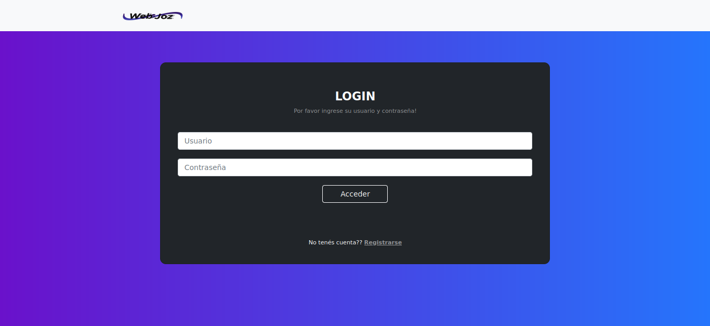

## __SIGUP:__

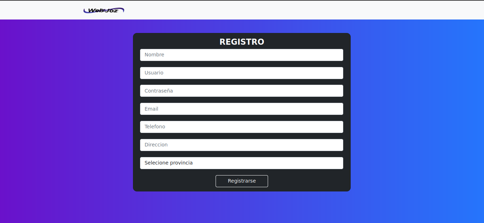

## __ HOME USER:__

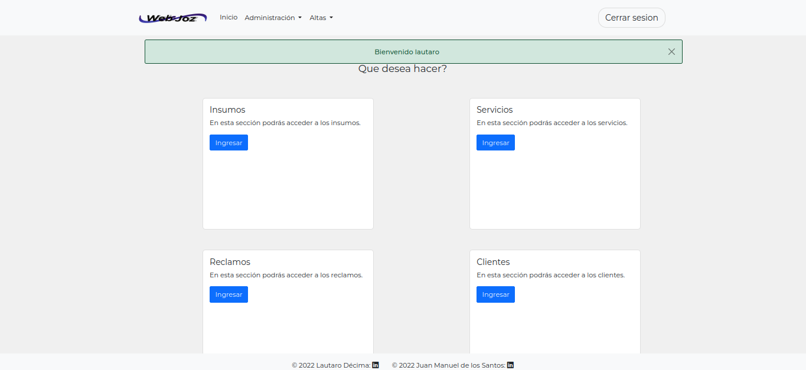

## __ HOME USER:__


## __ NAV ADMINISTRATION:__

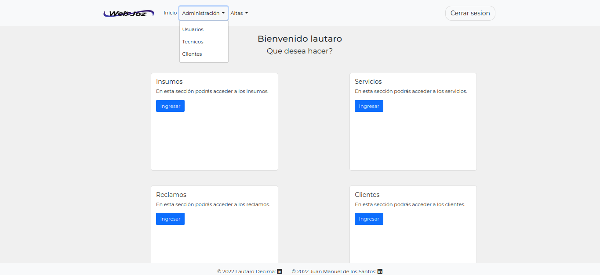


## __ USERS:__

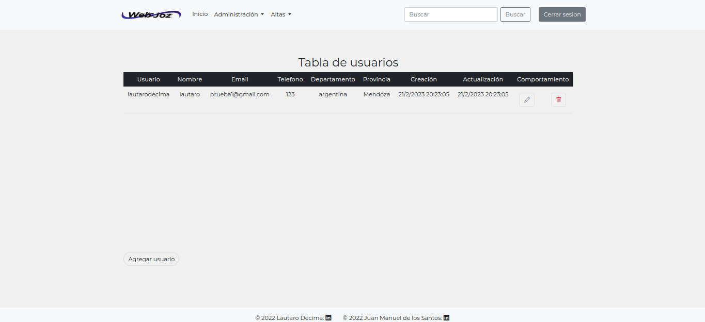


## __ ADD USER:__

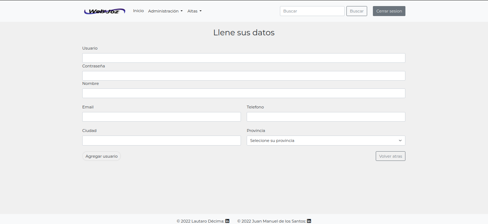


## __ RECLAMOS:__

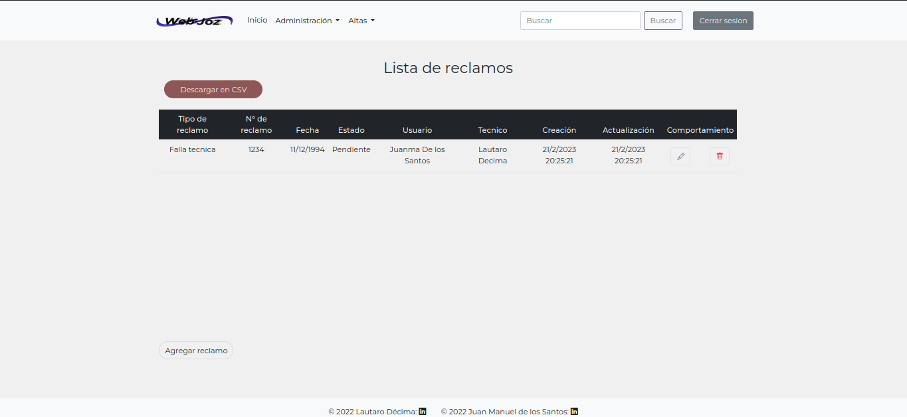

## __ ADD RECLAMOS:__

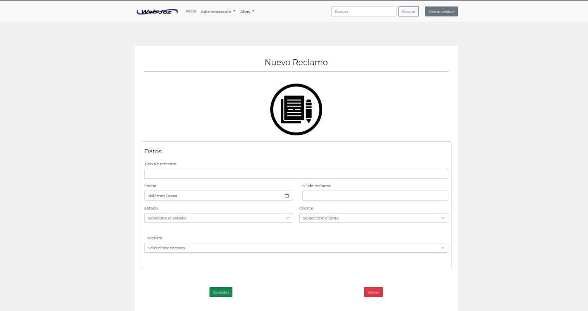

## __ SERVICIOS:__

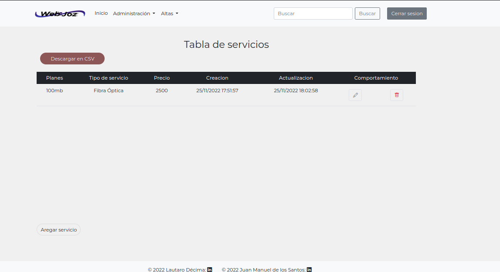

## __ PRESTACION DE SERVICIO:__

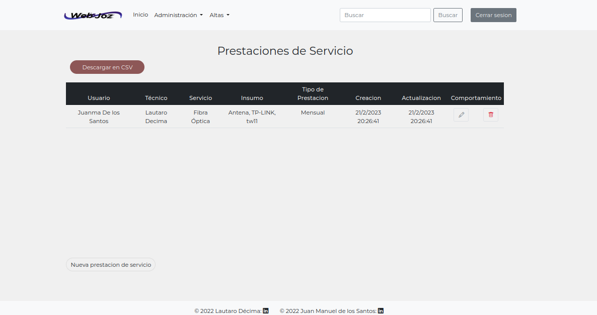

## __ ADD PRESTACION DE SERVICIO:__

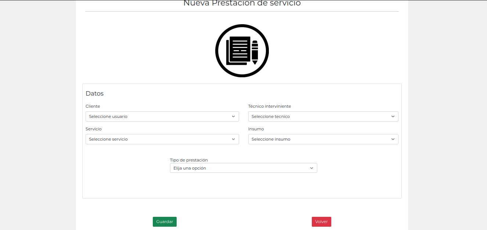